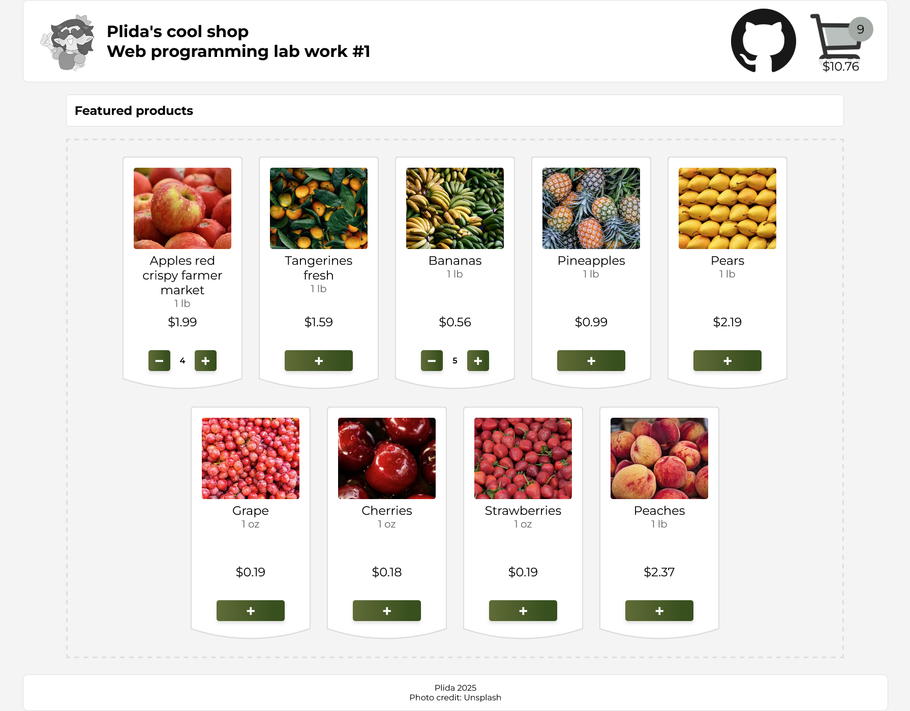
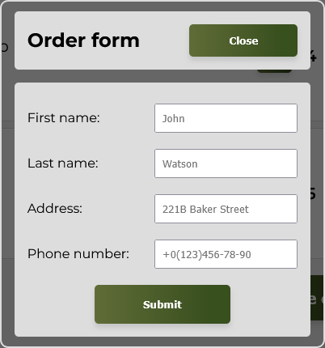
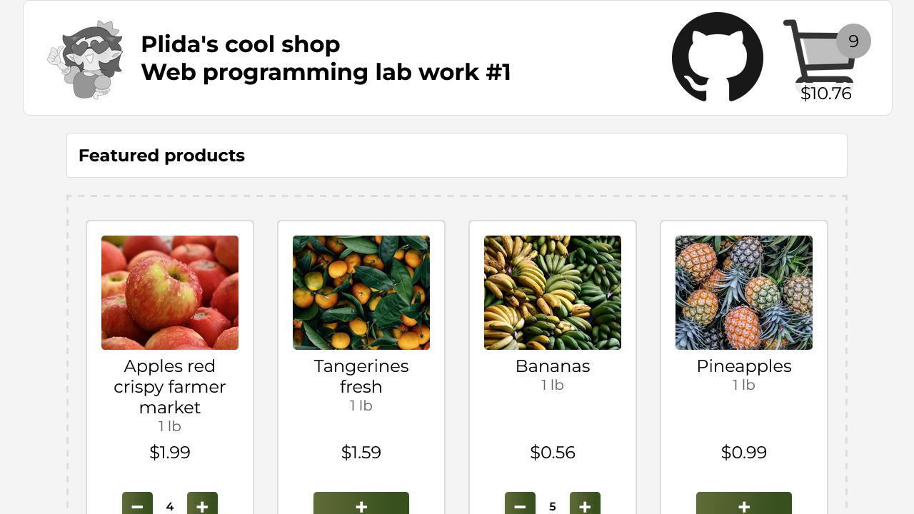
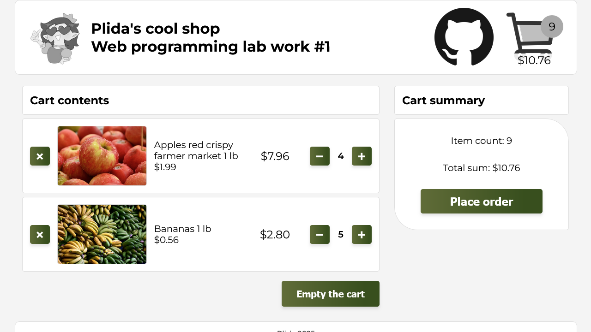
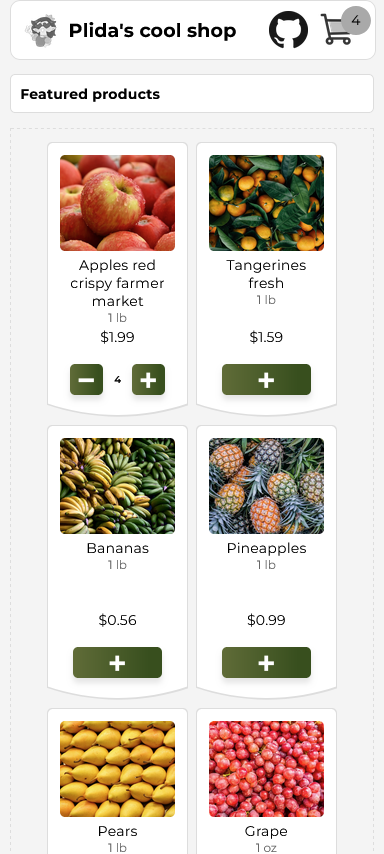
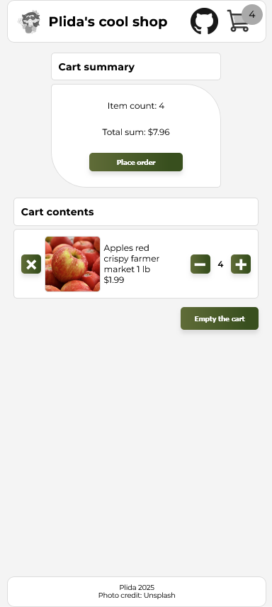
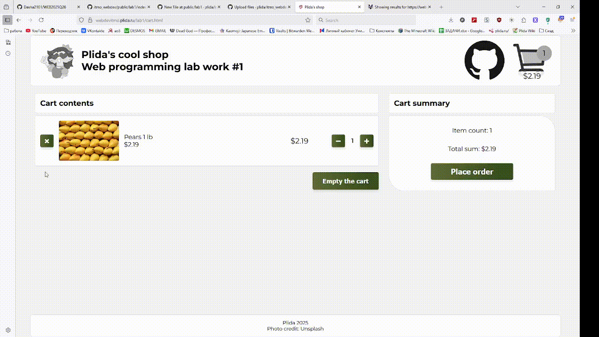
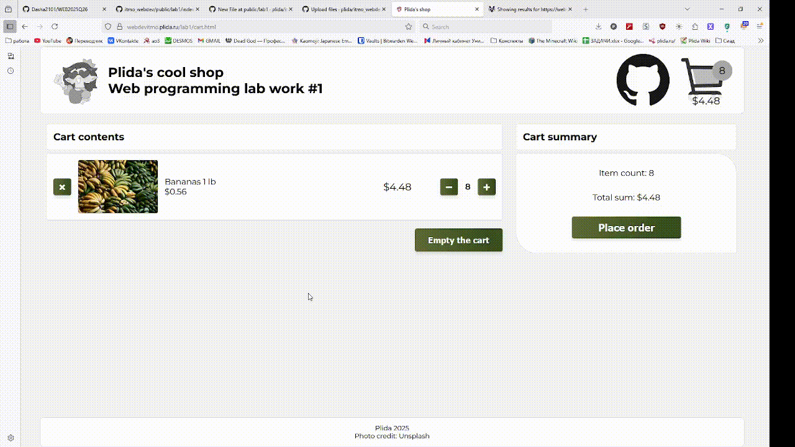
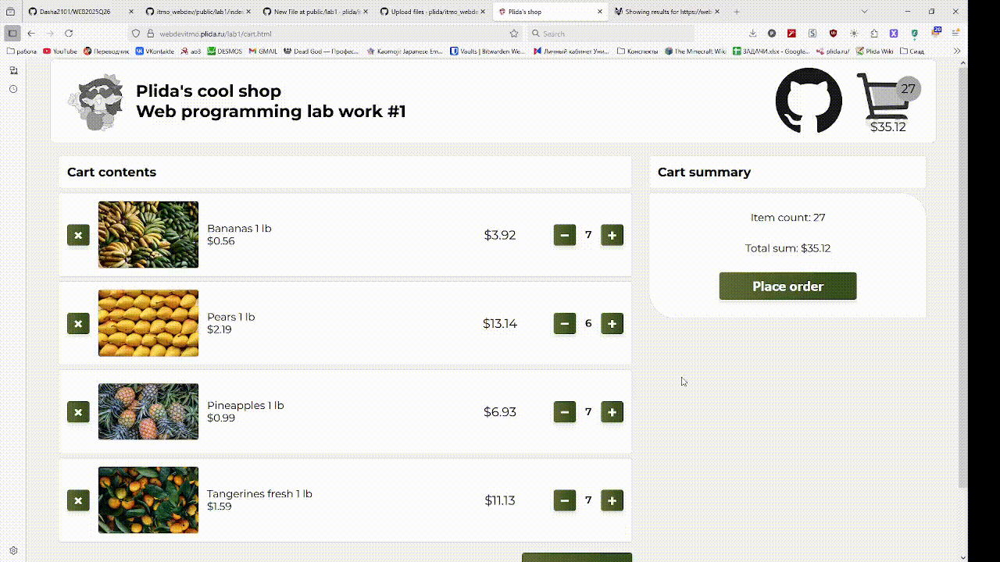
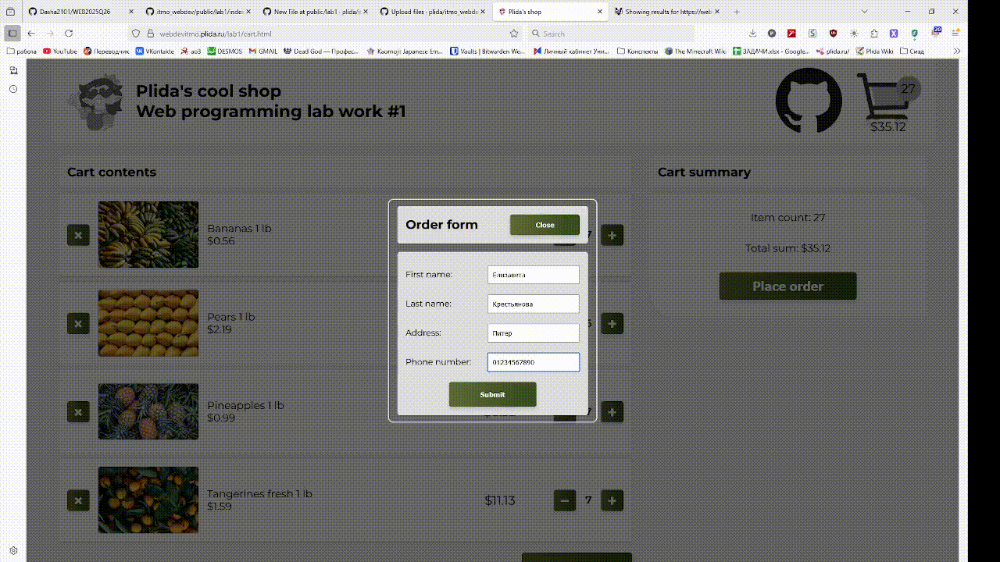

# Интернет-магазин

[Деплой](https://webdevitmo.plida.ru/lab1/index.html)

В рамках данной работы я разработала интернет-магазин с каталогом продуктов и функционалом корзины.

В работе был использован чистый javascript + html и css с предпроцессором scss. Сайт был поднят на личном физическом сервере Yetti с применением nginx и lxc.

## Требования к работе

### Макет и верстка
1. Создана HTML-страница магазина с карточками товаров, названием, ценой и кнопками «Добавить в корзину».

2. Использована семантическая разметка.

Семантическую разметку можно рассмотреть в html-файле  и .

3. Форма содержит все обязательные поля: имя, фамилия, адрес доставки, контактный номер телефона и кнопку «Создать заказ».

4. Использование CSS: flex/grid.

В работе был активно использован flexbox. Его применение можно рассмотреть .

### Адаптивность

1. Сайт корректно отображается на ноутбуке и планшете.

2. Сайт корректно отображается на телефоне.

### Логика корзины

1. Реализация добавления товара в корзину при нажатии на кнопку.

2. Реализация удаления товара из корзины.

3. Изменение количества товара в корзине с автоматическим пересчетом суммы.

4. Сохранение корзины в localStorage при обновлении страницы.

5. Корректное отображение итоговой суммы при изменении корзины.

### Форма заказа

1. Форма открывается при нажатии на кнопку «Оформить заказ» (встроенная или модальное окно)

2. После заполнения всех полей и нажатия «Создать заказ» появляется сообщение «Заказ создан!»

