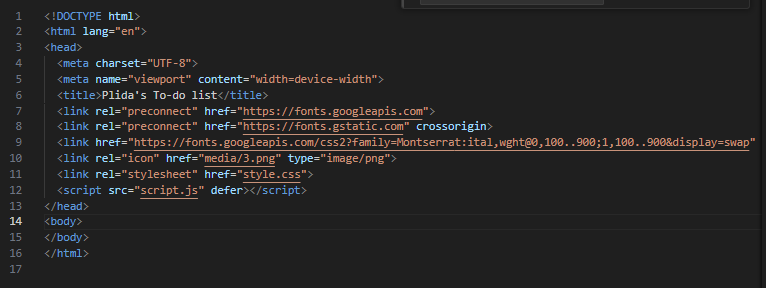
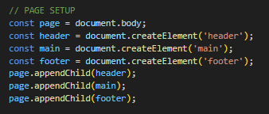
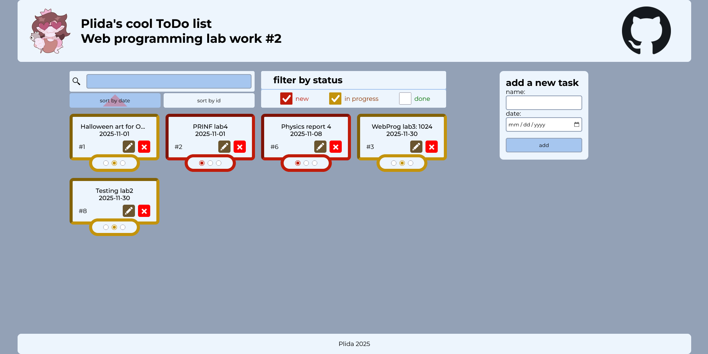
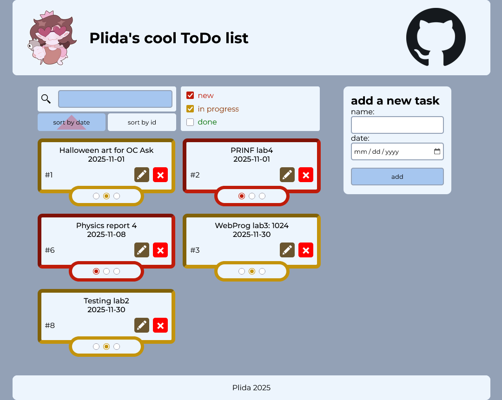
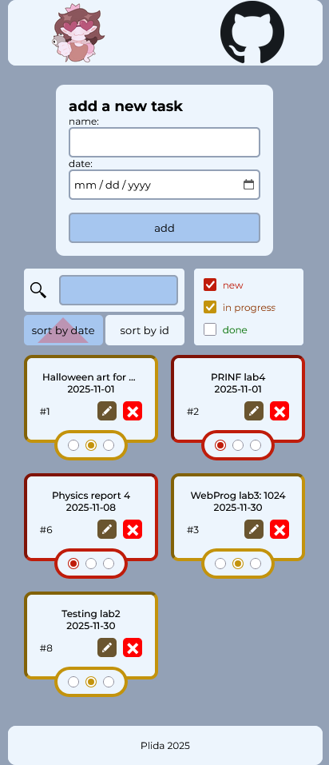
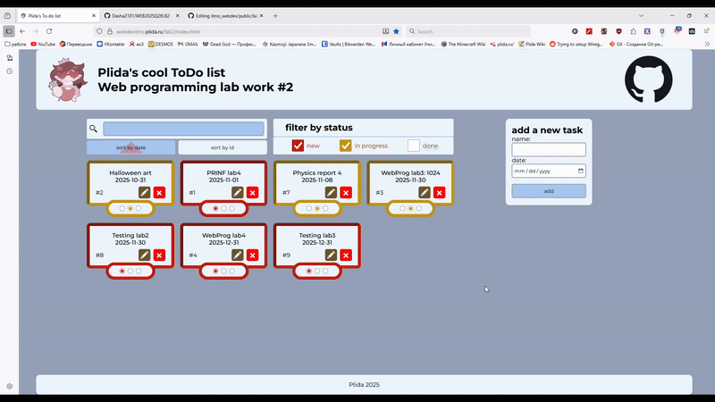
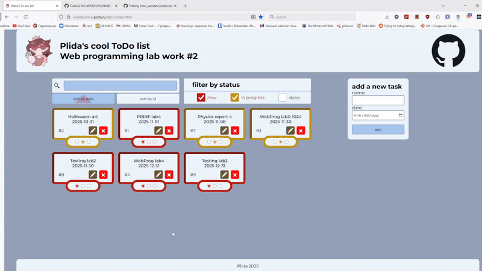
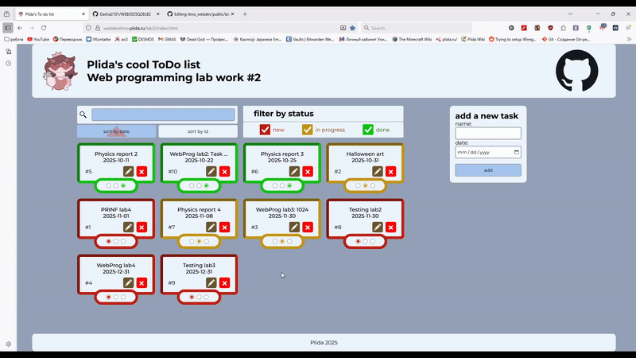
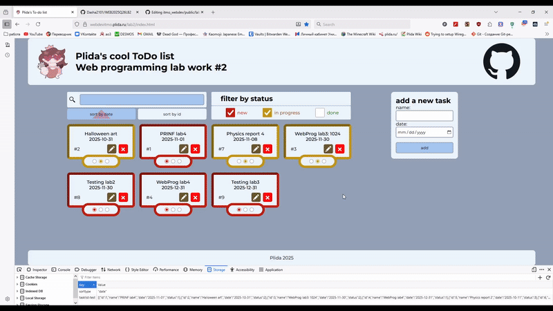
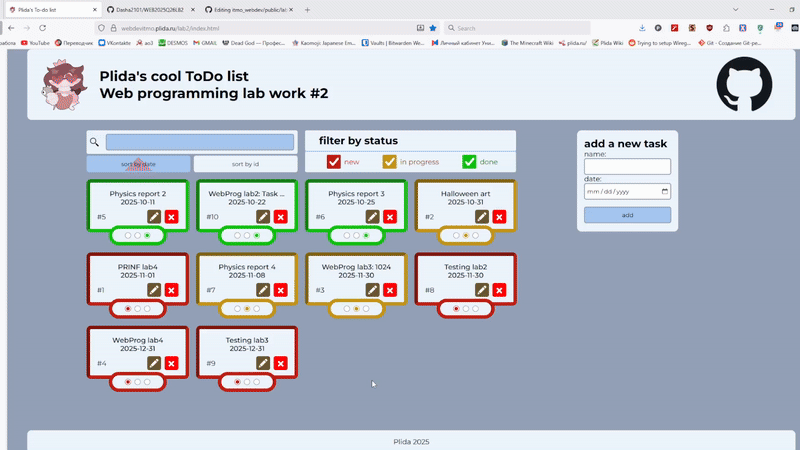

# To-Do list

[Деплой](https://webdevitmo.plida.ru/lab2/index.html)

В рамках данной работы я разработала веб приложение ToDo-лист.

В работе был использован чистый javascript + html и css с предпроцессором scss. Сайт был поднят на личном физическом сервере Yetti с применением nginx и lxc.

## Требования к работе

### Макет страницы

1. HTML-файл содержит исключительно базовый каркас и подключение скрипта.

2. Элементы страницы создаются через JavaScript с использованием семантических тегов.

Реализацию этого пункта можно увидеть , начиная с 267-й строки.

3. Текст, атрибуты и стили применены через JavaScript.

Текст вставляется в элементы с использованием textContent, аттрибуты используются для функционала drag-and-drop, а стили применяются для классов, которые назначаются элементам через JavaScript.

4. Структура страницы корректно собрана и добавлена через методы DOM (append, appendChild и т.д.).

Страница корректно собрана в структуру body, header(+nav), main, footer. Элементы были собраны методами DOM.

Пример создания основной структуры:

5. Применён адаптивный дизайн через CSS (flex/grid), корректное отображение на разных устройствах.

В работе был активно использован flexbox, а также для отображения списка задач был использован grid. Их применение можно рассмотреть .

Примеры отображения сайта при разной ширине экрана:

### Логика приложения

1. Реализовано добавление новой задачи в список.

2. Реализовано удаление задачи из списка.

3. Реализовано редактирование задачи (текст и дата).

4. Реализована отметка задачи как выполненной с визуальным оформлением.

5. Реализована сортировка задач по дате.

6. Реализована фильтрация задач по статусу (выполнено/невыполнено).

7. Реализован поиск задач по названию.

8. Обеспечено сохранение задач в localStorage и восстановление при загрузке страницы.

9. Возможность менять порядок задач с помощью drag-and-drop.

В данной реализации drag-and-drop только работает, если сортировка выставлена на ID, т.к. при drag-and-drop меняется порядок по ID. 

