# To-Do list

[Деплой](https://webdevitmo.plida.ru/lab3/index.html)

В рамках данной работы я разработала веб приложение игры 2024.

В работе был использован чистый javascript + html и css с предпроцессором scss. Сайт был поднят на личном физическом сервере Yetti с применением nginx и lxc.

## Требования к работе

### Логика игры

1. Сетка 4x4 генерируется динамически с помощью JavaScript

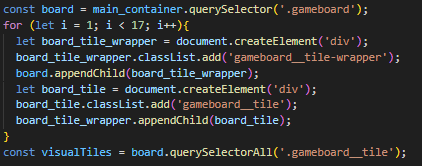
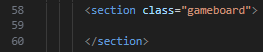

2. После каждого хода корректно появляется 1-2 новых плитки с значением 2 или 4.

В классической игре появляется только по 1 плитке, что было решено сэмулировать.

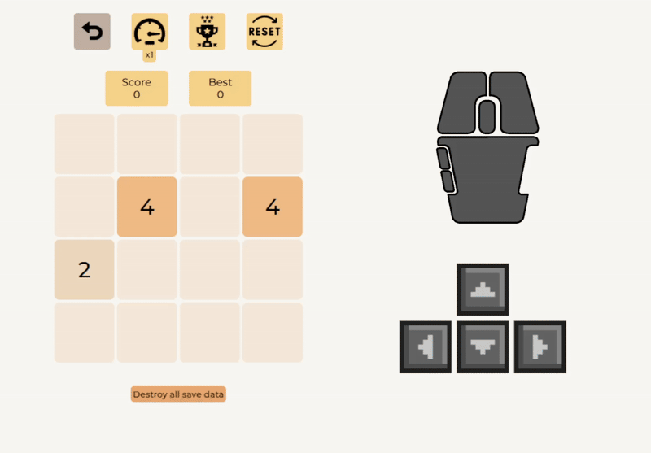

3. Слияние плиток однаковых чисел работает во всех направлениях

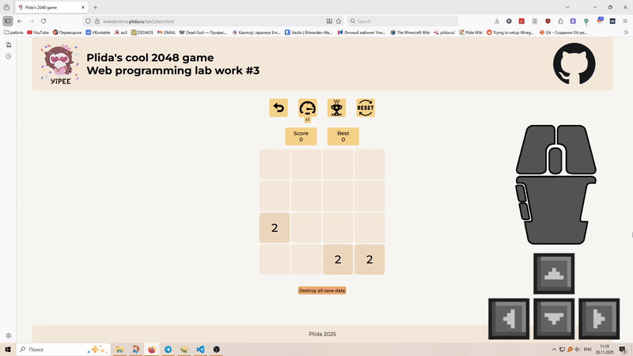

4. В начале игры на поле есть 1-3 случайных тайла с значением 2 либо 4

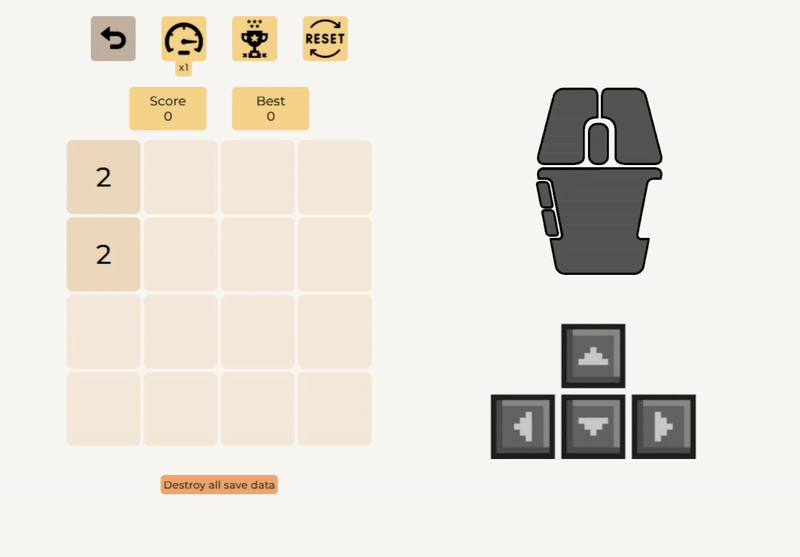

5. Корректный расчет и отображение очков

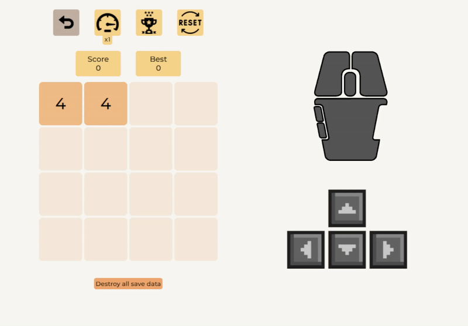

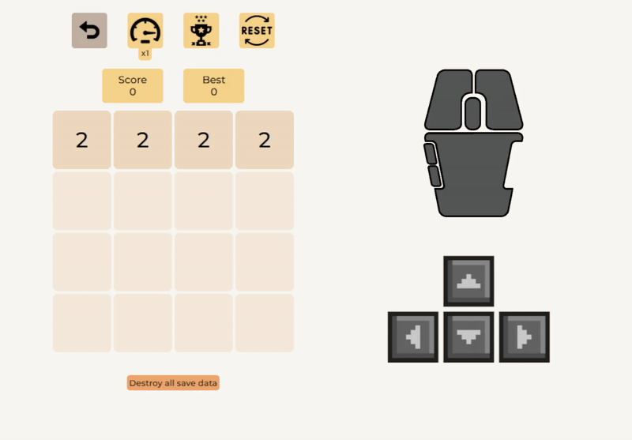

### Взаимодействие вне игрового поля

1. Реализована проверка на окончание игры (Нет возможных ходов)

Ситуация, когда игрок ещё мог двигаться, но он выбрал неверное направление:

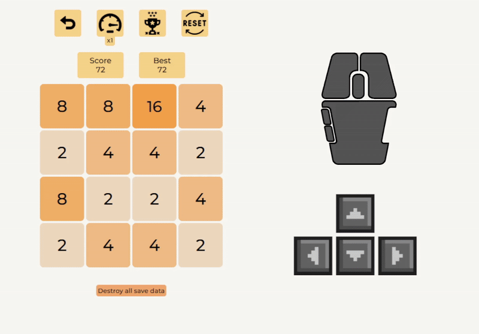

Ситуация, где возможных ходов нет:

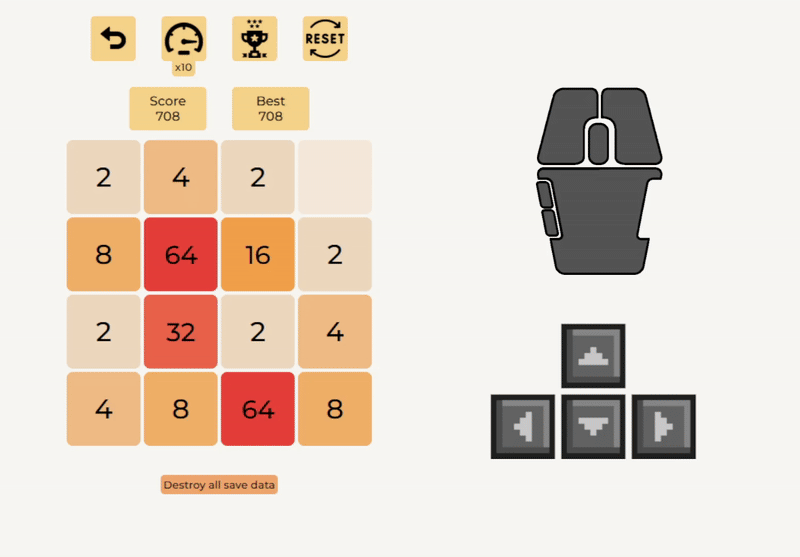

2. Кнопка "Начать заново" сбрасывает состояние поля и счет (Без перезагрузки страницы)

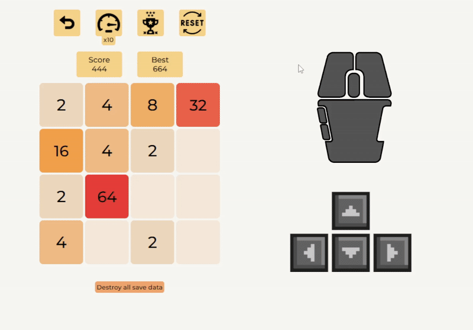

3. Реализована кнопка "Отмена хода" (undo)

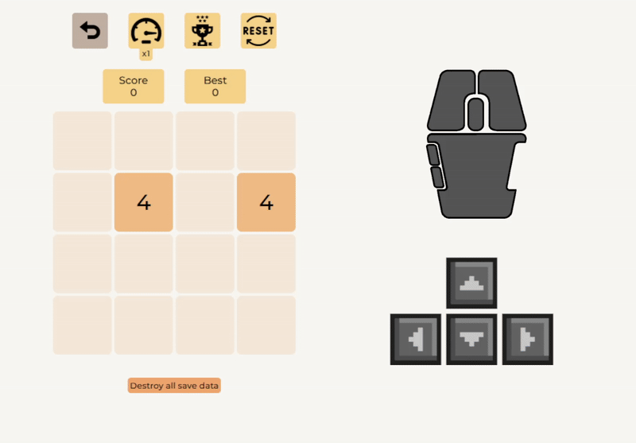

4. В таблице отражается топ-10 рекордов, которые сохранил пользователь. (Хранение в localStorage)

### Взаимодействие с игрой

1. Поддержка управления кнопками клавиатуры для десктопа и свайпами/виртуальными кнопками на мобильных устройствах

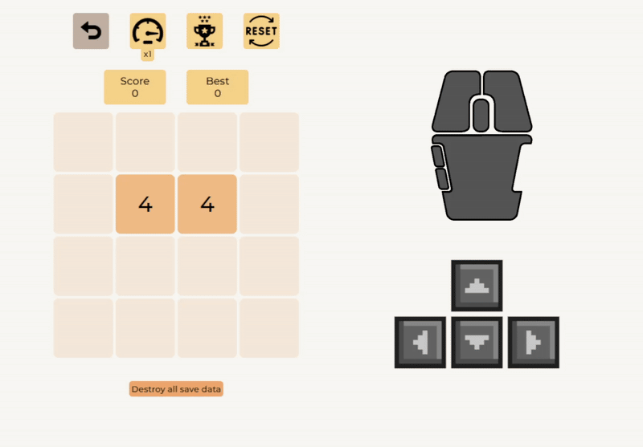

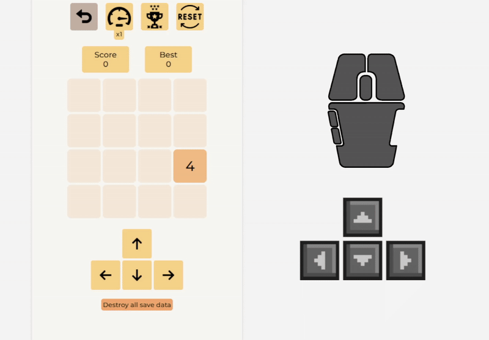

2. Состояние игры сохраняется в localStorage

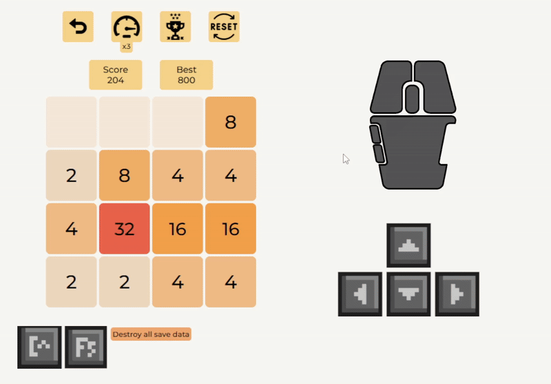

### Визуальное отображение

1. Каждое значение плитки имеет свой цвет

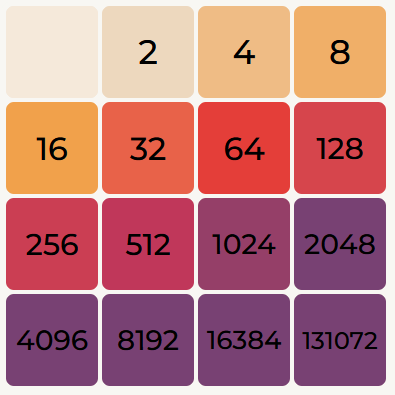

2. Плавная анимация движения и слияния плиток

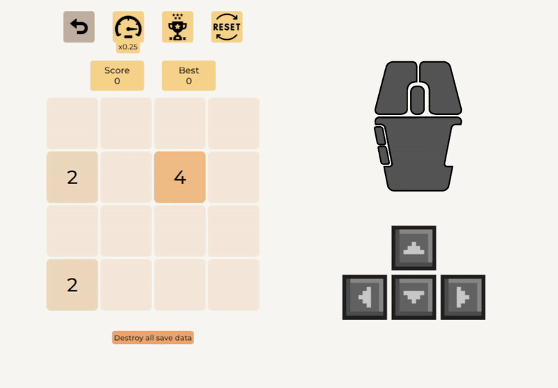