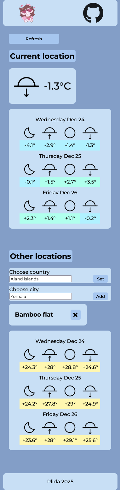
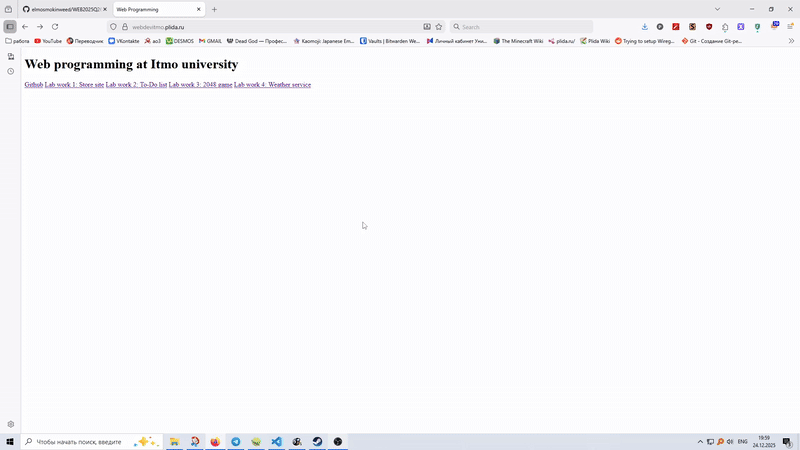
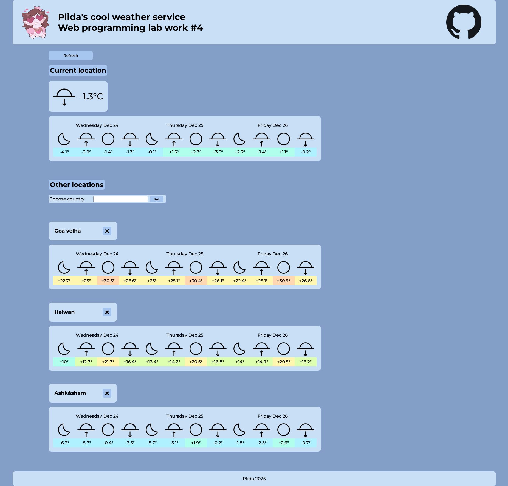
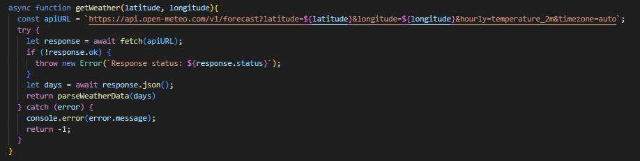
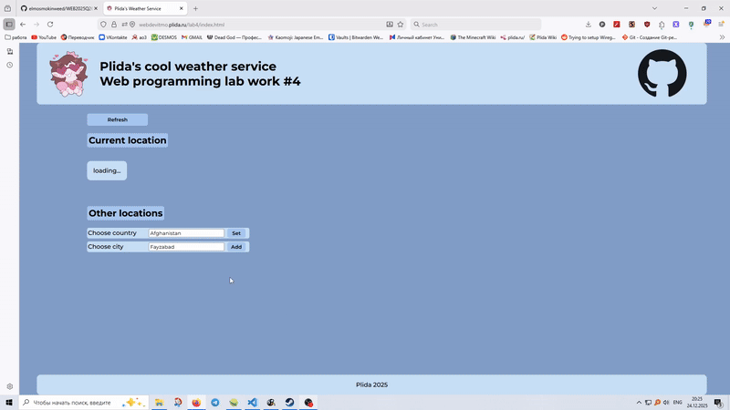
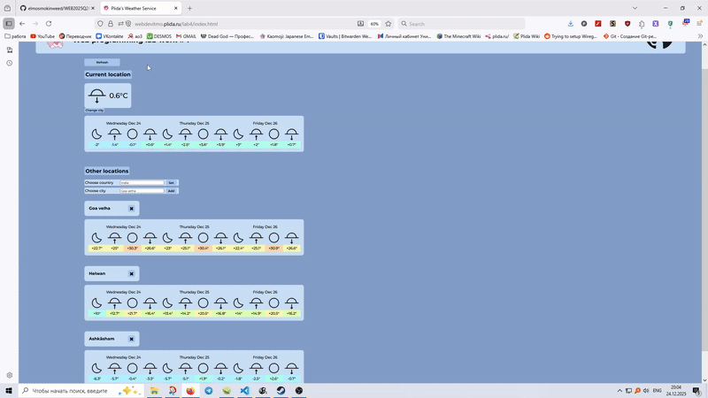
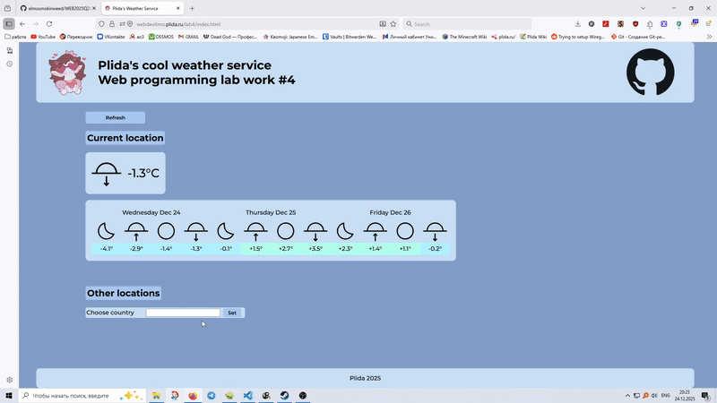
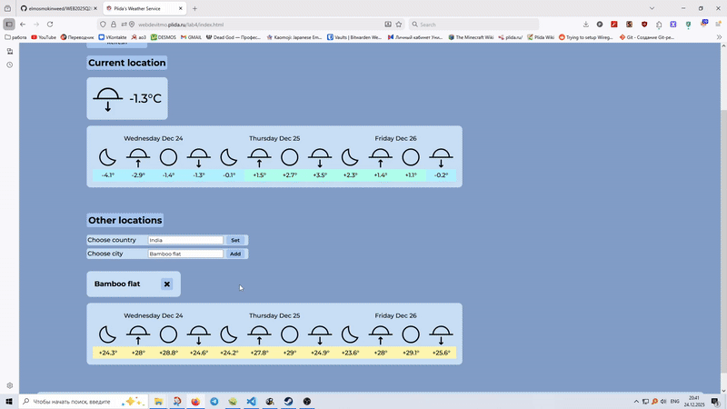
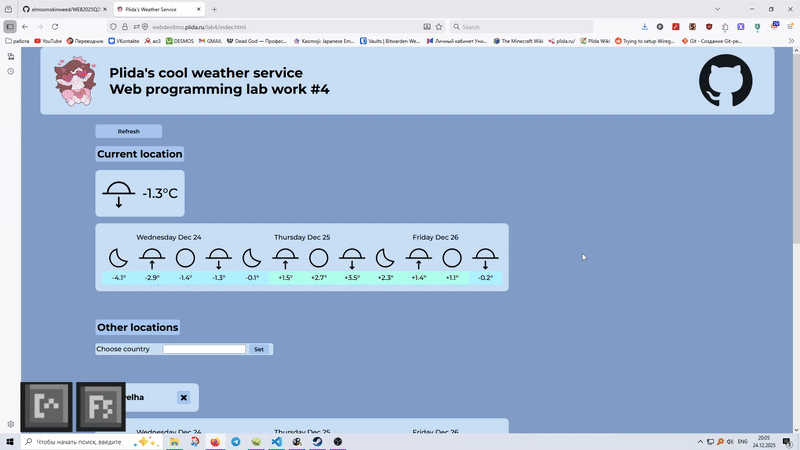

# To-Do list

[Деплой](https://webdevitmo.plida.ru/lab4/index.html)

В рамках данной работы я разработала веб фронт прогноза погоды.

В работе был использован чистый javascript + html и css с предпроцессором scss. Сайт был поднят на личном физическом сервере Yetti с применением nginx и lxc. Данные о погоде были взяты с open meteo.

## Требования к работе

### Верстка и адаптивность

Аккуратная базовая верстка, корректное отображение приложения, отсутствие наложения элементов интерфейса и наличие всех требуемых элементов интерфейса.

### Геолокация и загрузка текущей погоды 

1. Корректное получение геолокации при первом открытии

2. Корректная обработка отказа (форма ввода города)

3. Пока прогноза погоды для городов (первой локации и последующих выбранных). Прогноз минимум на 3 дня (сегодня + 2)

### HTTP-запросы и обработка состояний

1. Получение погоды через HTTP-запросы

Получение погоды было реализовано через fetch. 

2. Реализованы состояния интерфейса: загрузка / ошибка / успех

3. Кнопка «Обновить» выполняет новые запросы (не reload)

### Работа со списком городов — 3 балла

1. Добавление минимум 2 дополнительных городов

2. Выпадающий список, валидация города, отображение ошибок

### Сохранение состояния - 1 балл

1. Сохранение данных через localStorage, корректное восстановление

